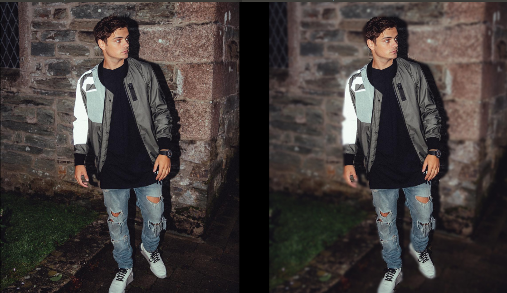
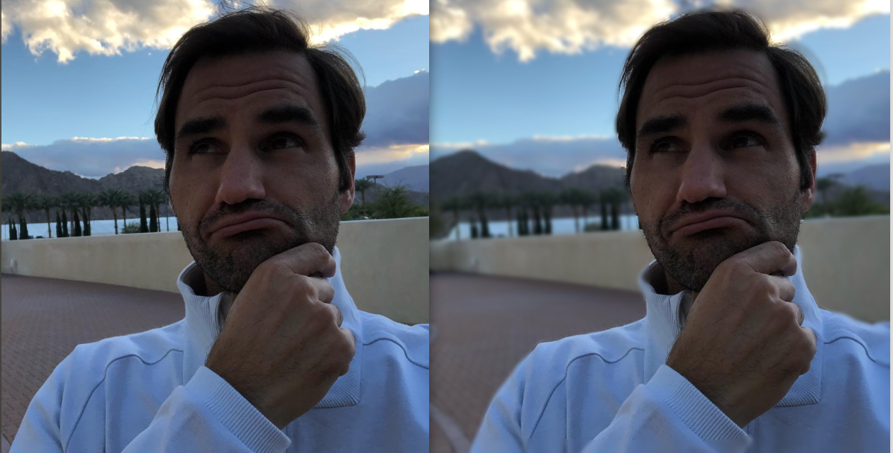
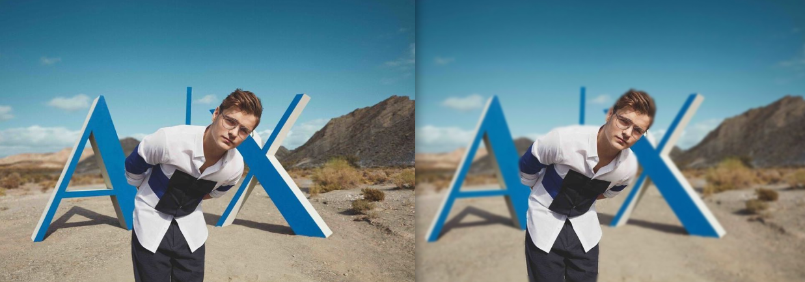

# Mask-RCNN-portrait-mode-effect

Original [Mask-RCNN](https://github.com/matterport/Mask_RCNN) is mainly used in object detection and scene segmentation.
I'm simply using Mask-RCNN model for Instance Segmentation. And then adding blur effect on background.
(note: keep only main person (person with maximum area covered in image) if there are multiple)

For download this weights of mask-rcnn [download page (use V2 coco)](https://github.com/matterport/Mask_RCNN/releases) and put it in the main folder.

Intensity of blur can be change: (input from user)

Some Result

   

   

   

# Credits:

[Mask-RCNN](https://github.com/matterport/Mask_RCNN) 

 
P.S. : generally for portrait effect we use image depth information. we can also make model for that to distinguish between object and background but still .. with strong segmentation models we can try this as byproduct with other applications.
